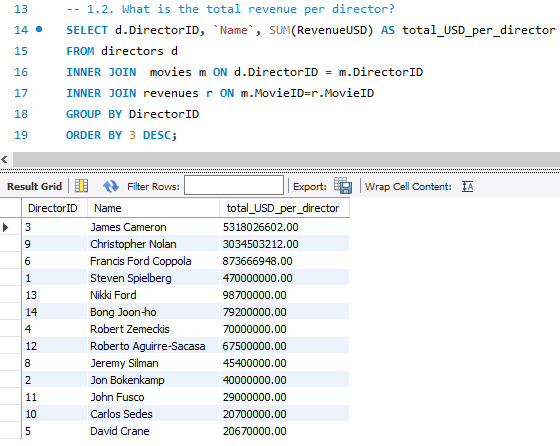
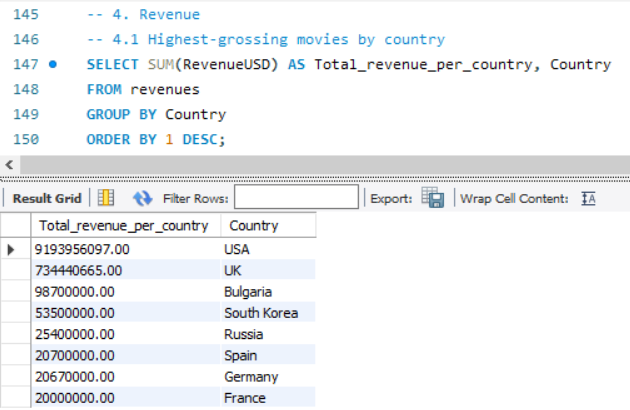

<h1 align="center">
      🎥 Filmography Database
       
      

      Movie Collections Based on Directors, Actors, and Awards
    </h1>
    <h3>Case Study</h3>
    <h4>Objective</h4>

To explore, analyze, and interpret various facets of the movie industry using a fictional database. The database includes directors, movies, cast members, awards, and revenues. This study investigates relationships among these entities, revealing insights into performance, trends, and key players in the industry.

<h3>Specifications for the Fictional Company</h3>
<h4>Database Overview:</h4>

The database consists of six tables:

<ul>
    <li><strong>Directors:</strong> Information about directors, including ID, name, age, and country.</li>
    <li><strong>Movies:</strong> Details of movies such as ID, name, release year, director, country, and budget.</li>
    <li><strong>Cast:</strong> Contains movie IDs, roles, actor IDs, and salaries.</li>
    <li><strong>Award_types:</strong> Defines award categories, locations, and countries.</li>
    <li><strong>Awards_obtained:</strong> Links awards to movies with the year awarded.</li>
    <li><strong>Revenues:</strong> Tracks movie revenues by country and year.</li>
</ul>
<h3>Entity Relationship Diagram</h3>
    
    <h3>Case Study Queries and Outputs</h3>
<h3>1. Analysis about Directors</h3>
<h4>1.1 Movies Directed by the Same Director:</h4>

<ul>
    <li>James Cameron directed <em>Titanic</em>, <em>Avatar</em>, and <em>Aliens</em>.</li>
    <li>Francis Ford Coppola directed <em>Apocalypse Now</em>, <em>The Godfather</em>, and <em>The Godfather: Part II</em>.</li>
</ul>

These directors are prolific, showcasing a consistent ability to produce iconic films.

<h4>1.2 Total Revenue Per Director:</h4>

<ul>
    <li>James Cameron has the highest total revenue, reflecting his movies' global appeal and blockbuster success.</li>
    <li>David Crane has the least revenue, indicating a potential focus on smaller-scale productions.</li>
</ul>
<h4>1.3 Number of Awards Won by Each Director:</h4>

<ul>
    <li>Christopher Nolan and Francis Ford Coppola each won 3 awards.</li>
    <li>James Cameron, Robert Zemeckis, and Roberto Aguirre-Sacasa won 2 awards each, demonstrating their consistent recognition.</li>
    <li>Others won 1 award each, showcasing varying levels of critical acclaim.</li>
</ul>
<h4>1.4 Directors with Movies Winning Awards After 1997:</h4>

    
James Cameron is the standout, with post-1997 award-winning films, indicating sustained success in modern cinema.

<h4>1.5 Directors with the Most Collaborations with Actors:</h4>

    
James Cameron leads with collaborations involving 4 actors, followed by Christopher Nolan and Francis Ford Coppola with 3 each, showing strong director-actor synergies.

<h3>2. Analysis about Movies</h3>
<h4>2.1 Movies That Won Multiple Awards:</h4>

    
<em>Forrest Gump</em> and <em>Riverdale</em> are highlighted as exceptional, receiving multiple accolades.

<h4>2.2 Top 5 Movies by Revenue-to-Budget Ratio:</h4>

    
Films like <em>Jaws</em>, <em>The Godfather</em>, and <em>Riverdale</em> had impressive financial efficiency, with revenues between $16,804,878 and $67,142,857.

<h4>2.3 Movies Directed and Acted in by the Same Director:</h4>

<ul>
    <li>Christopher Nolan acted and directed films such as <em>Inception</em> and <em>The Dark Knight</em>.</li>
    <li>Bong Joon-ho directed and acted in <em>Parasite</em>.</li>
</ul>
<h4>2.4 Top 3 Highest Revenue-Generating Movies:</h4>

    
<em>Avatar</em> ($2.85B), <em>Titanic</em> ($2.18B), and <em>The Dark Knight</em> ($1.00B) dominate the box office.

<h4>2.5 Movies That Did Not Win Awards:</h4>

    
Films such as <em>Lucifer</em>, <em>Marco Polo</em>, and <em>The Dark Knight</em> failed to win awards, suggesting that commercial success does not always correlate with critical recognition.

<h3>3. Analysis about Actors</h3>
<h4>3.1 Actors in Different Roles Across Movies:</h4>

    
Actors with IDs 12, 30, and 50 exhibited versatility by playing diverse roles in different films.

<h4>3.2 Actors in Movies from Diverse Countries:</h4>

    
Actor IDs 12, 22, and 50 showcased global appeal by acting in films from multiple countries.

<h4>3.3 Actors Winning Awards for Different Roles:</h4>

    
Actor ID 30 achieved a rare distinction by winning awards for varied performances.

<h4>3.4 Actors with Salaries Above/Below the Average:</h4>

    
The average salary is $1,257,227.27. Actors earning significantly above or below this average highlight disparities based on experience, reputation, and roles played.

<h3>4. Analysis about Revenue</h3>
<h4>4.1 Highest-Grossing Movies by Country:</h4>

    
USA: $9.19B, UK: $734M, Bulgaria: $98.7M. This indicates strong dominance of the US market.

<h4>4.2 Revenue Trends Over Years for DirectorID 3:</h4>

    
Revenues grew from $183.3M (1986) to $2.18B (1997) and peaked at $2.85B (2009), showing an upward trajectory of success.

<h4>4.3 Revenue by Decade:</h4>

    
The highest revenue was between 2002-2011 ($4.80B), while earlier decades showed progressively lesser revenues. This reflects increasing globalization and marketing in cinema.

<h2>Conclusion</h2>

The analysis of the database provides valuable insights into the dynamics of the movie industry. Directors like James Cameron and Christopher Nolan consistently achieve high revenue and critical acclaim. Movies with strong revenue-to-budget ratios, such as <em>Jaws</em> and <em>The Godfather</em>, highlight financial efficiency. Actor versatility and global market trends underline the importance of diverse talent and international appeal.  The database proves to be a powerful tool for identifying industry trends, key contributors, and their impacts.

